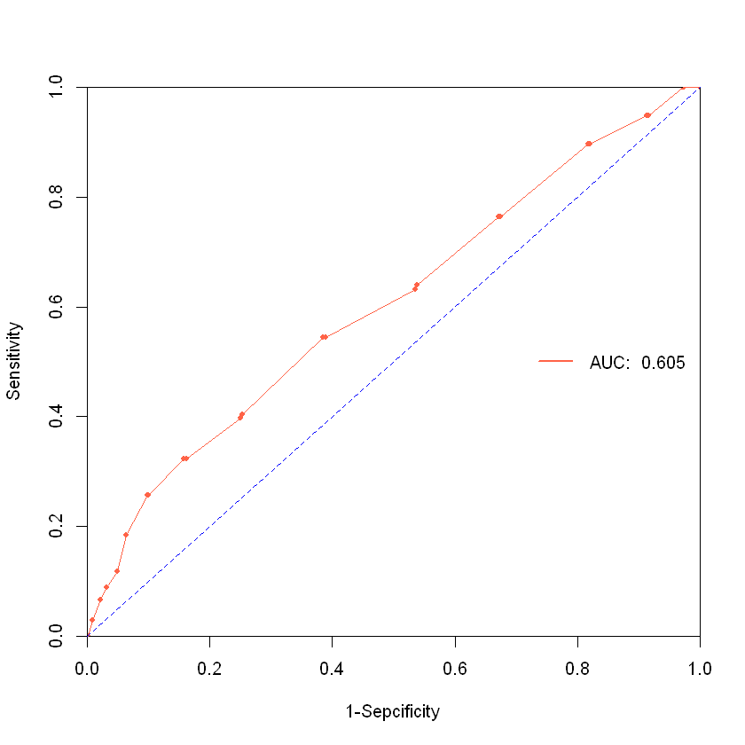
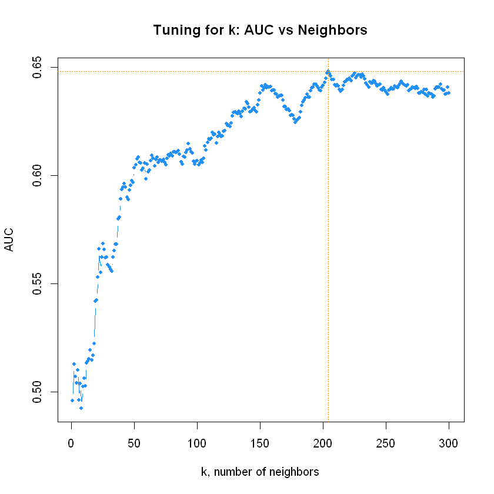
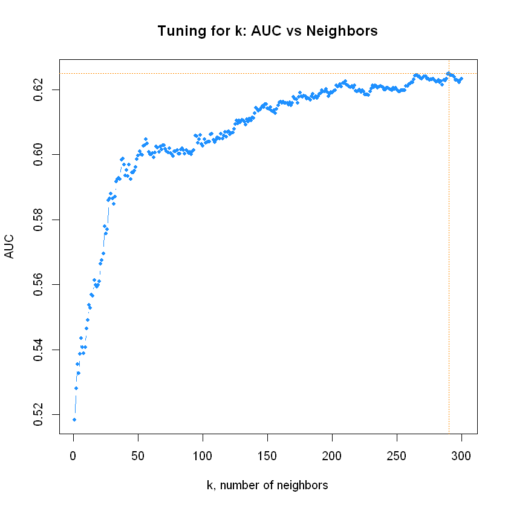
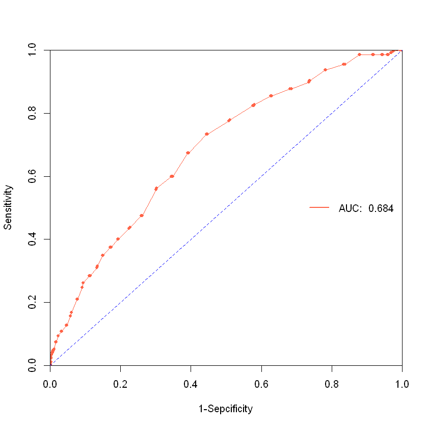
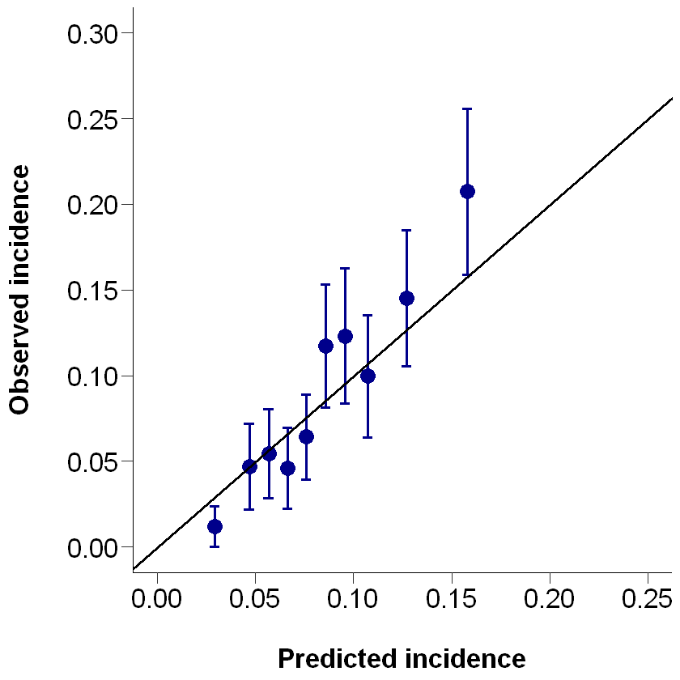
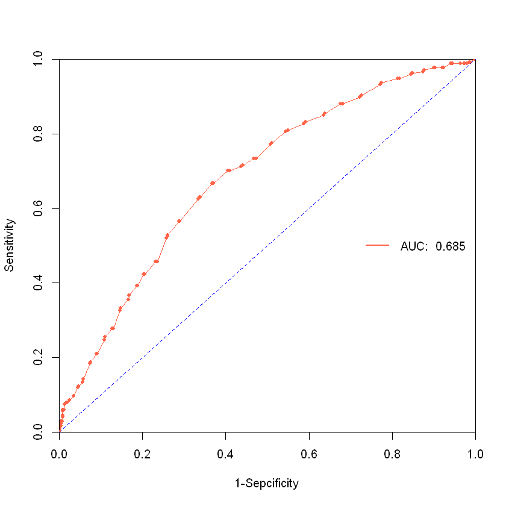
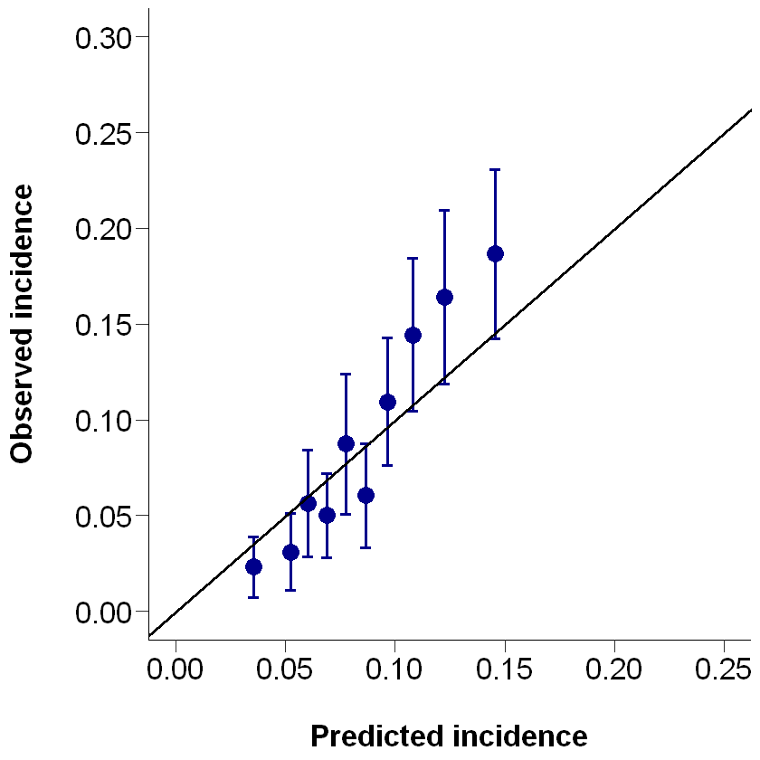

# Load the packages


```R
rm(list = ls())
setwd('C:/Users/Tao/Desktop/KNN')
```


```R
pkgs <- c('dplyr', 'ggplot2', 'class', 'caret', 'pROC', 'Hmisc')
# install.packages(pkgs)
suppressMessages(for (i in pkgs) library(i, character.only = TRUE))
```

# Load the data


```R
load(file = 'simulated_dataset.R')
str(dataset_final)
```

    'data.frame':	8000 obs. of  21 variables:
     $ ID      : num  1 2 3 4 5 6 7 8 9 10 ...
     $ X_1     : num  56 63 67 50 64 65 59 59 59 58 ...
     $ X_2     : num  0 0 1 1 0 0 0 0 0 0 ...
     $ X_3     : num  15.4 14.8 28.5 23.3 17.9 18.9 20.8 14.6 25.6 17.9 ...
     $ X_4     : num  127 122 130 85 109 82 139 97 66 88 ...
     $ X_5     : num  0 0 0 0 0 0 0 0 0 0 ...
     $ X_6     : num  1 0 1 0 0 0 1 0 1 1 ...
     $ X_7     : num  1 0 1 0 0 1 1 0 0 0 ...
     $ X_8     : num  0 0 1 0 0 0 1 0 0 0 ...
     $ X_9     : num  1 1 1 1 1 2 1 2 1 1 ...
     $ X_10    : num  3.85 3.96 2.31 3.59 4.38 5.5 4.27 4.77 2.66 3.1 ...
     $ X_11    : num  4.2 3.72 2.57 3.1 2.61 2.57 2.09 3.48 2.78 2.85 ...
     $ X_12    : num  1 0 0 0 0 1 0 0 1 0 ...
     $ X_13    : num  0 0 0 0 1 0 1 3 2 1 ...
     $ X_14    : num  0 0 0 0 0 0 0 0 0 1 ...
     $ X_15    : num  0 0 0 0 0 0 0 0 0 0 ...
     $ X_16    : num  3 3 4 2 1 3 2 2 3 1 ...
     $ Y       : num  1.51 2.85 1.61 5.21 4.71 ...
     $ delta   : num  1 0 0 0 0 1 1 1 0 0 ...
     $ Y_binary: num  0 0 1 0 0 0 0 0 0 0 ...
     $ type    : chr  "raw" "raw" "raw" "raw" ...
    

# Step 1: Clean and feature scaling

## Clean the data


```R
names(dataset_final) <- 
    c('ID', 'age', 'male', 'BMI', 'SBP', 'MI', 'HF', 'COPD', 
    'cancer', 'albuminuria', 'TC', 'LDLC', 'No_outpatient', 'No_inpatient', 
    'liver_disease', 'hypoglycemia', 'CKD_stage', 
    'AKI_time', 'AKI_status', 'AKI_binary', 'type')
```


```R
head(dataset_final)
```


<table class="dataframe">
<caption>A data.frame: 6 × 21</caption>
<thead>
	<tr><th></th><th scope=col>ID</th><th scope=col>age</th><th scope=col>male</th><th scope=col>BMI</th><th scope=col>SBP</th><th scope=col>MI</th><th scope=col>HF</th><th scope=col>COPD</th><th scope=col>cancer</th><th scope=col>albuminuria</th><th scope=col>⋯</th><th scope=col>LDLC</th><th scope=col>No_outpatient</th><th scope=col>No_inpatient</th><th scope=col>liver_disease</th><th scope=col>hypoglycemia</th><th scope=col>CKD_stage</th><th scope=col>AKI_time</th><th scope=col>AKI_status</th><th scope=col>AKI_binary</th><th scope=col>type</th></tr>
	<tr><th></th><th scope=col>&lt;dbl&gt;</th><th scope=col>&lt;dbl&gt;</th><th scope=col>&lt;dbl&gt;</th><th scope=col>&lt;dbl&gt;</th><th scope=col>&lt;dbl&gt;</th><th scope=col>&lt;dbl&gt;</th><th scope=col>&lt;dbl&gt;</th><th scope=col>&lt;dbl&gt;</th><th scope=col>&lt;dbl&gt;</th><th scope=col>&lt;dbl&gt;</th><th scope=col>⋯</th><th scope=col>&lt;dbl&gt;</th><th scope=col>&lt;dbl&gt;</th><th scope=col>&lt;dbl&gt;</th><th scope=col>&lt;dbl&gt;</th><th scope=col>&lt;dbl&gt;</th><th scope=col>&lt;dbl&gt;</th><th scope=col>&lt;dbl&gt;</th><th scope=col>&lt;dbl&gt;</th><th scope=col>&lt;dbl&gt;</th><th scope=col>&lt;chr&gt;</th></tr>
</thead>
<tbody>
	<tr><th scope=row>1</th><td>1</td><td>56</td><td>0</td><td>15.4</td><td>127</td><td>0</td><td>1</td><td>1</td><td>0</td><td>1</td><td>⋯</td><td>4.20</td><td>1</td><td>0</td><td>0</td><td>0</td><td>3</td><td>1.511000</td><td>1</td><td>0</td><td>raw</td></tr>
	<tr><th scope=row>2</th><td>2</td><td>63</td><td>0</td><td>14.8</td><td>122</td><td>0</td><td>0</td><td>0</td><td>0</td><td>1</td><td>⋯</td><td>3.72</td><td>0</td><td>0</td><td>0</td><td>0</td><td>3</td><td>2.854611</td><td>0</td><td>0</td><td>raw</td></tr>
	<tr><th scope=row>3</th><td>3</td><td>67</td><td>1</td><td>28.5</td><td>130</td><td>0</td><td>1</td><td>1</td><td>1</td><td>1</td><td>⋯</td><td>2.57</td><td>0</td><td>0</td><td>0</td><td>0</td><td>4</td><td>1.614861</td><td>0</td><td>1</td><td>raw</td></tr>
	<tr><th scope=row>4</th><td>4</td><td>50</td><td>1</td><td>23.3</td><td> 85</td><td>0</td><td>0</td><td>0</td><td>0</td><td>1</td><td>⋯</td><td>3.10</td><td>0</td><td>0</td><td>0</td><td>0</td><td>2</td><td>5.208720</td><td>0</td><td>0</td><td>raw</td></tr>
	<tr><th scope=row>5</th><td>5</td><td>64</td><td>0</td><td>17.9</td><td>109</td><td>0</td><td>0</td><td>0</td><td>0</td><td>1</td><td>⋯</td><td>2.61</td><td>0</td><td>1</td><td>0</td><td>0</td><td>1</td><td>4.713570</td><td>0</td><td>0</td><td>raw</td></tr>
	<tr><th scope=row>6</th><td>6</td><td>65</td><td>0</td><td>18.9</td><td> 82</td><td>0</td><td>0</td><td>1</td><td>0</td><td>2</td><td>⋯</td><td>2.57</td><td>1</td><td>0</td><td>0</td><td>0</td><td>3</td><td>1.428300</td><td>1</td><td>0</td><td>raw</td></tr>
</tbody>
</table>


```R
dataset_final <- dataset_final %>%
        mutate(
        albuminuria = case_when( ## relabel of categorical variable
            albuminuria == 1 ~ "normal to mild",
            albuminuria == 2 ~ "moderate",
            albuminuria == 3 ~ "severe"),
        albuminuria = factor(albuminuria, levels = c("normal to mild", "moderate", "severe")),
        CKD_stage = case_when(
            CKD_stage == 1 ~ "G1-2",
            CKD_stage == 2 ~ "G3a",
            CKD_stage == 3 ~ "G3b",
            CKD_stage == 4 ~ "G4"),
        CKD_stage = factor(CKD_stage, levels = c("G1-2", "G3a", "G3b", "G4")))

data <- dataset_final %>% filter(type == "raw")
data <- data[, c('AKI_binary', 'age', 'male', 'BMI', 'SBP', 'MI', 'HF', 'COPD', 
                 'cancer', 'albuminuria', 'TC', 'LDLC', 'No_outpatient', 'No_inpatient', 
                 'liver_disease', 'hypoglycemia', 'CKD_stage')]
data$AKI_binary <- as.factor(data$AKI_binary)

data_external <- dataset_final %>% filter(type == "external")
data_external <- data_external[, c('AKI_binary', 'age', 'male', 'BMI', 'SBP', 'MI', 'HF', 'COPD', 
                          'cancer', 'albuminuria', 'TC', 'LDLC', 'No_outpatient', 'No_inpatient', 
                          'liver_disease', 'hypoglycemia', 'CKD_stage')]
data_external$AKI_binary <- as.factor(data_external$AKI_binary)
```

## Feature scaling


```R
data <- 
    data %>% 
    mutate(
        AKI_binary = as.factor(AKI_binary),
        male = as.numeric(male),
        MI = as.numeric(MI),
        HF = as.numeric(HF),
        COPD = as.numeric(COPD),
        cancer = as.numeric(cancer),
        albuminuria = as.numeric(albuminuria) - 1,
        liver_disease = as.numeric(liver_disease),
        hypoglycemia = as.numeric(hypoglycemia),
        CKD_stage = as.numeric(CKD_stage) - 1
    )

# scaling
data_scaled <- as.data.frame(scale(data[, -1]))
data_scaled <- cbind(AKI_binary = data$AKI_binary, data_scaled)
str(data_scaled)
levels(data_scaled$AKI_binary) <- c('no', 'yes')
```

    'data.frame':	5000 obs. of  17 variables:
     $ AKI_binary   : Factor w/ 2 levels "0","1": 1 1 2 1 1 1 1 1 1 1 ...
     $ age          : num  -1.2 0.208 1.013 -2.408 0.41 ...
     $ male         : num  -0.983 -0.983 1.017 1.017 -0.983 ...
     $ BMI          : num  -1.472 -1.602 1.366 0.239 -0.931 ...
     $ SBP          : num  0.9398 0.6594 1.108 -1.4151 -0.0695 ...
     $ MI           : num  -0.4 -0.4 -0.4 -0.4 -0.4 ...
     $ HF           : num  1.711 -0.584 1.711 -0.584 -0.584 ...
     $ COPD         : num  1.556 -0.642 1.556 -0.642 -0.642 ...
     $ cancer       : num  -0.518 -0.518 1.931 -0.518 -0.518 ...
     $ albuminuria  : num  -0.639 -0.639 -0.639 -0.639 -0.639 ...
     $ TC           : num  -0.5067 -0.4083 -1.8839 -0.7392 -0.0327 ...
     $ LDLC         : num  2.31 1.484 -0.495 0.417 -0.427 ...
     $ No_outpatient: num  1.299 -0.534 -0.534 -0.534 -0.534 ...
     $ No_inpatient : num  -0.812 -0.812 -0.812 -0.812 0.379 ...
     $ liver_disease: num  -0.289 -0.289 -0.289 -0.289 -0.289 ...
     $ hypoglycemia : num  -0.136 -0.136 -0.136 -0.136 -0.136 ...
     $ CKD_stage    : num  1.009 1.009 2.267 -0.249 -1.507 ...
    


```R
# normalizing
normalized <- function(x){
    return((x - min(x)) / (max(x) - min(x)))
}
data_normalized <- as.data.frame(lapply(data[, -1], normalized))
data_normalized <- cbind(AKI_binary = data$AKI_binary, data_normalized)
str(data_normalized)
levels(data_normalized$AKI_binary) <- c('no', 'yes')
```

    'data.frame':	5000 obs. of  17 variables:
     $ AKI_binary   : Factor w/ 2 levels "0","1": 1 1 2 1 1 1 1 1 1 1 ...
     $ age          : num  0.333 0.545 0.667 0.152 0.576 ...
     $ male         : num  0 0 1 1 0 0 0 0 0 0 ...
     $ BMI          : num  0.0839 0.0629 0.542 0.3601 0.1713 ...
     $ SBP          : num  0.614 0.575 0.638 0.283 0.472 ...
     $ MI           : num  0 0 0 0 0 0 0 0 0 0 ...
     $ HF           : num  1 0 1 0 0 0 1 0 1 1 ...
     $ COPD         : num  1 0 1 0 0 1 1 0 0 0 ...
     $ cancer       : num  0 0 1 0 0 0 1 0 0 0 ...
     $ albuminuria  : num  0 0 0 0 0 0.5 0 0.5 0 0 ...
     $ TC           : num  0.443 0.456 0.256 0.411 0.507 ...
     $ LDLC         : num  0.636 0.531 0.279 0.395 0.287 ...
     $ No_outpatient: num  0.25 0 0 0 0 0.25 0 0 0.25 0 ...
     $ No_inpatient : num  0 0 0 0 0.2 0 0.2 0.6 0.4 0.2 ...
     $ liver_disease: num  0 0 0 0 0 0 0 0 0 1 ...
     $ hypoglycemia : num  0 0 0 0 0 0 0 0 0 0 ...
     $ CKD_stage    : num  0.667 0.667 1 0.333 0 ...
    


```R
data_external <- 
    data_external %>% 
    mutate(
        AKI_binary = as.factor(AKI_binary),
        male = as.numeric(male),
        MI = as.numeric(MI),
        HF = as.numeric(HF),
        COPD = as.numeric(COPD),
        cancer = as.numeric(cancer),
        albuminuria = as.numeric(albuminuria) - 1,
        liver_disease = as.numeric(liver_disease),
        hypoglycemia = as.numeric(hypoglycemia),
        CKD_stage = as.numeric(CKD_stage) - 1
    )

# scaling
data_external_scaled <- as.data.frame(scale(data_external[, -1]))
data_external_scaled <- cbind(AKI_binary = data_external$AKI_binary, data_external_scaled)
str(data_external_scaled)
levels(data_external_scaled$AKI_binary) <- c('no', 'yes')
```

    'data.frame':	3000 obs. of  17 variables:
     $ AKI_binary   : Factor w/ 2 levels "0","1": 1 1 1 1 1 1 1 1 1 1 ...
     $ age          : num  -0.401 0.855 -2.076 1.413 0.436 ...
     $ male         : num  -0.995 1.005 1.005 1.005 1.005 ...
     $ BMI          : num  -0.668 -1.025 2.245 1.274 1.987 ...
     $ SBP          : num  -2.349 1.119 0.868 0.767 0.315 ...
     $ MI           : num  -0.418 -0.418 2.389 -0.418 -0.418 ...
     $ HF           : num  -0.603 1.658 -0.603 -0.603 1.658 ...
     $ COPD         : num  -0.638 1.567 1.567 -0.638 -0.638 ...
     $ cancer       : num  -0.519 -0.519 1.928 -0.519 -0.519 ...
     $ albuminuria  : num  -0.846 0.49 -0.846 1.825 -0.846 ...
     $ TC           : num  -1.68 -0.616 -0.698 0.852 -0.185 ...
     $ LDLC         : num  -0.9545 0.0344 0.5219 -0.2581 0.4244 ...
     $ No_outpatient: num  1.194 -0.579 -0.579 -0.579 -0.579 ...
     $ No_inpatient : num  1.897 -0.739 -0.739 0.579 -0.739 ...
     $ liver_disease: num  -0.295 -0.295 -0.295 -0.295 -0.295 ...
     $ hypoglycemia : num  -0.171 -0.171 -0.171 -0.171 -0.171 ...
     $ CKD_stage    : num  1.05 -1.43 1.05 -1.43 -0.19 ...
    


```R
# normalizing
normalized <- function(x){
    return((x - min(x)) / (max(x) - min(x)))
}
data_external_normalized <- as.data.frame(lapply(data_external[, -1], normalized))
data_external_normalized <- cbind(AKI_binary = data_external$AKI_binary, data_external_normalized)
str(data_external_normalized)
levels(data_external_normalized$AKI_binary) <- c('no', 'yes')
```

    'data.frame':	3000 obs. of  17 variables:
     $ AKI_binary   : Factor w/ 2 levels "0","1": 1 1 1 1 1 1 1 1 1 1 ...
     $ age          : num  0.48 0.66 0.24 0.74 0.6 0.58 0.64 0.56 0.54 0.5 ...
     $ male         : num  0 1 1 1 1 1 0 0 0 0 ...
     $ BMI          : num  0.237 0.168 0.798 0.611 0.748 ...
     $ SBP          : num  0.146 0.625 0.59 0.576 0.514 ...
     $ MI           : num  0 0 1 0 0 0 0 0 0 0 ...
     $ HF           : num  0 1 0 0 1 0 0 0 0 1 ...
     $ COPD         : num  0 1 1 0 0 0 0 1 1 0 ...
     $ cancer       : num  0 0 1 0 0 1 0 0 1 0 ...
     $ albuminuria  : num  0 0.5 0 1 0 0 1 0.5 0 0 ...
     $ TC           : num  0.272 0.427 0.415 0.64 0.489 ...
     $ LDLC         : num  0.203 0.348 0.419 0.305 0.404 ...
     $ No_outpatient: num  0.333 0 0 0 0 ...
     $ No_inpatient : num  0.4 0 0 0.2 0 0.2 0 0 0 0.2 ...
     $ liver_disease: num  0 0 0 0 0 1 0 1 0 0 ...
     $ hypoglycemia : num  0 0 0 0 0 0 0 0 0 0 ...
     $ CKD_stage    : num  0.667 0 0.667 0 0.333 ...
    

## Randome split the data into train and test


```R
# set.seed(123)
# id <- sample(seq_len(nrow(data_normalized)), size = 0.7 * nrow(data_normalized))
# train <- data_normalized[id, ]
# test <- data_normalized[-id, ]
```


```R
set.seed(123)
id <- sample(seq_len(nrow(data_normalized)), size = 0.7 * nrow(data_normalized))
train <- data_normalized[id, ]
test <- data_normalized[-id, ]
```

# Step 2: Model fitting


```R
KNN_pred <- 
    knn(
        train = train[, -1], 
        test = test[, -1], 
        cl = train$AKI_binary, 
        k = ceiling(sqrt(nrow(train))), 
        prob = TRUE 
    )
pred_prob <- attr(KNN_pred, 'prob')
pred_prob <- ifelse(KNN_pred == 'yes', pred_prob, 1-pred_prob)
```


```R
# confusion matrix
cm <- table(actual = test$AKI_binary, predicted = KNN_pred)
cm
```


          predicted
    actual   no  yes
       no  1364    0
       yes  136    0


```R
# AUC 
roc <- roc(as.factor(as.numeric(test$AKI_binary) - 1), pred_prob)
AUC <- auc(roc)
round(AUC, 3)
```

    Setting levels: control = 0, case = 1
    
    Setting direction: controls < cases
    
    


0.605


```R
plot(1 - roc$specificities, 
     roc$sensitivities,
     pch = 20,
     col = "tomato", 
     xlim = c(0, 1), ylim = c(0, 1),
     xlab = '1-Sepcificity',
     ylab = 'Sensitivity',
     xaxs = 'i', 
     yaxs = 'i')
lines(1- roc$specificities, 
      roc$sensitivities,
      col = "tomato")
abline(0, 1, lty = 2, col = 'blue')
legend("right", 
       legend = paste("AUC: ", round(AUC, 3)), 
       col = "tomato", 
       lwd = 2, 
       bty = "n")
```


    

    


# Step 3: Model tuning

## Random split


```R
# using the for loop 
results <- data.frame()
suppressMessages(for(k in 1:300) {
    KNN_fit <-
        knn(
            train = train[, -1],
            test = test[, -1],
            cl = train$AKI_binary,
            k = k,
            prob = TRUE
        )
    pred_prob <- attr(KNN_fit, 'prob')
    pred_prob <- ifelse(KNN_fit == 'yes', pred_prob, 1-pred_prob)

    # AUC 
    roc <- roc(as.factor(as.numeric(test$AKI_binary) - 1), pred_prob)
    AUC <- auc(roc)

    result <- data.frame(k = k, AUC = AUC)
    results <- rbind(results, result)
})
```


```R
plot(results, 
    type = "b", 
    col = "dodgerblue", 
    cex = 1, 
    pch = 20, 
    xlab = "k, number of neighbors", 
    ylab = "AUC",
    main = "Tuning for k: AUC vs Neighbors")
# add line for max AUC seen
abline(h = max(results$AUC), col = "darkorange", lty = 3)
abline(v = results$k[results$AUC == max(results$AUC)], col = "darkorange", lty = 3)
```


    

    


## Cross-validation


```R
# Using caret package
ctrl <- trainControl(
            method = "cv",
            classProbs = TRUE,
            summaryFunction = twoClassSummary
        )
KNN_tune <- train(
                AKI_binary ~ ., 
                data = data_normalized, 
                method = "knn", 
                metric = "ROC",
                trControl = ctrl, 
                tuneGrid = data.frame(k = c(1:300))
		    )

plot(KNN_tune$results[, c('k', 'ROC')], 
    type = "b", 
    col = "dodgerblue", 
    cex = 1, 
    pch = 20, 
    xlab = "k, number of neighbors", 
    ylab = "AUC",
    main = "Tuning for k: AUC vs Neighbors")
# add line for max AUC seen
abline(h = max(KNN_tune$results$ROC), col = "darkorange", lty = 3)
abline(v = KNN_tune$results$k[KNN_tune$results$ROC == max(KNN_tune$results[['ROC']])], col = "darkorange", lty = 3)
```


    

    


# Step 4: Model refit

## Random split


```R
best_model_k_split <- results$k[results$AUC == max(results$AUC)]
best_model_k_split
```


204


```R
best_model_split <-
        knn(
            train = data_normalized[, -1],
            test = data_normalized[, -1],
            cl = data_normalized$AKI_binary,
            k = best_model_k_split,
            prob = TRUE
        )
pred_prob_split <- attr(best_model_split, 'prob')
pred_prob_split <- 
    ifelse(
        best_model_split == 'yes', 
        pred_prob_split, 
        1 - pred_prob_split
    )
```


```R
# AUC 
roc_split <- roc(as.factor(
                    as.numeric(data_normalized$AKI_binary)- 1), 
                pred_prob_split)
AUC_split <- auc(roc_split)
AUC_split
```

    Setting levels: control = 0, case = 1
    
    Setting direction: controls < cases
    
    


0.654201324309117


## Cross-validation


```R
best_model_k_cv <- KNN_tune$bestTune$k
best_model_k_cv
```


290


```R
best_model_cv <- 
    knn3(
        AKI_binary ~ .,
        data = data_normalized,
        k = best_model_k_cv
    )

predictions_cv <- predict(best_model_cv, data_normalized, type = "class")
pred_prob_cv <- predict(best_model_cv, data_normalized, type = "prob")
pred_prob_cv <- pred_prob_cv[,2]
```


```R
# AUC 
roc_cv <- roc(as.factor(
                as.numeric(data_normalized$AKI_binary) - 1), 
              pred_prob_cv)
AUC_cv <- auc(roc_cv)
AUC_cv
```

    Setting levels: control = 0, case = 1
    
    Setting direction: controls < cases
    
    


0.646764404738151


# Step 5: Model evaluation in external data

## Random split


```R
best_model_external <-
        knn(
            train = data_normalized[, -1],
            test = data_external_normalized[, -1],
            cl = data_normalized$AKI_binary,
            k = best_model_k_split,
            prob = TRUE
        )
pred_prob <- attr(best_model_external, 'prob')
pred_prob <- ifelse(best_model_external == 'yes', pred_prob, 1-pred_prob)
```


```R
# confusion matrix
cm <- table(actual = data_external_normalized$AKI_binary, predicted = best_model_external)
cm
```


          predicted
    actual   no  yes
       no  2733    0
       yes  267    0


```R
# AUC 
roc <- roc(data_external$AKI_binary, pred_prob)
AUC <- auc(roc)
AUC
```

    Setting levels: control = 0, case = 1
    
    Setting direction: controls < cases
    
    


0.683627490883377


```R
plot(1 - roc$specificities, 
     roc$sensitivities,
     pch = 20,
     col = "tomato", 
     xlim = c(0, 1), ylim = c(0, 1),
     xlab = '1-Sepcificity',
     ylab = 'Sensitivity',
     xaxs = 'i', 
     yaxs = 'i')
lines(1- roc$specificities, 
      roc$sensitivities,
      col = "tomato")
abline(0, 1, lty = 2, col = 'blue')
legend("right", 
       legend = paste("AUC: ", round(AUC, 3)), 
       col = "tomato", 
       lwd = 2, 
       bty = "n")
```


    

    


```R
png(filename = 'roc_split.png', width = 1600, height = 1600, unit = 'px', res = 300)
plot(1 - roc$specificities, 
     roc$sensitivities,
     pch = 20,
     col = "tomato", 
     xlim = c(0, 1), ylim = c(0, 1),
     xlab = '1-Sepcificity',
     ylab = 'Sensitivity',
     xaxs = 'i', 
     yaxs = 'i')
lines(1- roc$specificities, 
      roc$sensitivities,
      col = "tomato")
abline(0, 1, lty = 2, col = 'blue')
legend("right", 
       legend = paste("AUC: ", round(AUC, 3)), 
       col = "tomato", 
       lwd = 2, 
       bty = "n")
dev.off()
```


<strong>png:</strong> 2


```R
# calibration curve
n_group <- 10
cal_data <- data.frame(AKI_binary = as.numeric(data_external$AKI_binary) - 1, pred_prob)
cal_data <- cal_data[order(cal_data$pred_prob),]
cal_data <- cal_data %>% mutate(tiles = cut2(pred_prob, g = n_group))
cal_data <- cal_data %>% 
            group_by(tiles) %>% 
            summarise(
                n = n(),
                obs_mean = mean(AKI_binary),
                obs_sd = sd(AKI_binary),
                # obs_mean = sum(AKI_binary) / n(),
                # obs_sd = sqrt(obs_mean * (1 - obs_mean)),
                pred_mean = mean(pred_prob),
                obs_upper = obs_mean + 1.96*obs_sd/sqrt(n()),
                obs_lower = obs_mean - 1.96*obs_sd/sqrt(n())
            )

cal_plot <- 
    ggplot(
        cal_data, 
        aes(x = pred_mean, y = obs_mean)) +
    # geom_line() +
    geom_point(size = 5, colour = 'darkblue') +
    geom_errorbar(
        aes(ymin = obs_lower, ymax = obs_upper), 
        linewidth = 1,
        width = .005, 
        colour = 'darkblue'
    ) +
    geom_abline(linewidth = 1) +
    xlab("\nPredicted incidence") +
    ylab("Observed incidence\n") +
    scale_x_continuous(limits = c(0, 0.25), breaks = seq(0, 0.5, 0.05)) +
    scale_y_continuous(limits = c(0, 0.3), breaks = seq(0, 0.5, 0.05)) +
    theme(
        panel.background = element_blank(),
        panel.grid = element_blank(),
        # panel.grid.major.y = element_line(color = "gray"),
        plot.title = element_text(size = 20, face = "bold", hjust = 0), 
        axis.title = element_text(size = 20, face = "bold"),
        axis.text = element_text(size = 20, color = 'black'),
        axis.ticks.length.x = unit(0.3, 'cm'),
        axis.ticks.length.y = unit(0.3, 'cm'),
        axis.line = element_line(colour = "black", linewidth = 0.5)
    )
cal_plot
```


    

    


```R
png(filename = 'calibration_curve_split.png', width = 3200, height = 3200, unit = 'px', res = 300)
cal_plot
dev.off()
```


<strong>png:</strong> 2


## Cross-validation


```R
best_model_external <-
        knn(
            train = data_normalized[, -1],
            test = data_external_normalized[, -1],
            cl = data_normalized$AKI_binary,
            k = best_model_k_cv,
            prob = TRUE
        )
pred_prob <- attr(best_model_external, 'prob')
pred_prob <- ifelse(best_model_external == 'yes', pred_prob, 1-pred_prob)
```


```R
# confusion matrix
cm <- table(actual = data_external$AKI_binary, predicted = best_model_external)
cm
```


          predicted
    actual   no  yes
         0 2733    0
         1  267    0


```R
# AUC 
roc <- roc(data_external$AKI_binary, pred_prob)
AUC <- auc(roc)
AUC
```

    Setting levels: control = 0, case = 1
    
    Setting direction: controls < cases
    
    


0.685108214073791


```R
plot(1 - roc$specificities, 
     roc$sensitivities,
     pch = 20,
     col = "tomato", 
     xlim = c(0, 1), ylim = c(0, 1),
     xlab = '1-Sepcificity',
     ylab = 'Sensitivity',
     xaxs = 'i', 
     yaxs = 'i')
lines(1- roc$specificities, 
      roc$sensitivities,
      col = "tomato")
abline(0, 1, lty = 2, col = 'blue')
legend("right", 
       legend = paste("AUC: ", round(AUC, 3)), 
       col = "tomato", 
       lwd = 2, 
       bty = "n")
```


    

    


```R
png(filename = 'roc_cv.png', width = 1600, height = 1600, unit = 'px', res = 300)
plot(1 - roc$specificities, 
     roc$sensitivities,
     pch = 20,
     col = "tomato", 
     xlim = c(0, 1), ylim = c(0, 1),
     xlab = '1-Sepcificity',
     ylab = 'Sensitivity',
     xaxs = 'i', 
     yaxs = 'i')
lines(1- roc$specificities, 
      roc$sensitivities,
      col = "tomato")
abline(0, 1, lty = 2, col = 'blue')
legend("right", 
       legend = paste("AUC: ", round(AUC, 3)), 
       col = "tomato", 
       lwd = 2, 
       bty = "n")
dev.off()
```


<strong>png:</strong> 2


```R
# calibration curve
n_group <- 10
cal_data <- data.frame(AKI_binary = as.numeric(data_external$AKI_binary) - 1, pred_prob)
cal_data <- cal_data[order(cal_data$pred_prob),]
cal_data <- cal_data %>% mutate(tiles = cut2(pred_prob, g = n_group))
cal_data <- cal_data %>% 
            group_by(tiles) %>% 
            summarise(
                n = n(),
                obs_mean = mean(AKI_binary),
                obs_sd = sd(AKI_binary),
                # obs_mean = sum(AKI_binary) / n(),
                # obs_sd = sqrt(obs_mean * (1 - obs_mean)),
                pred_mean = mean(pred_prob),
                obs_upper = obs_mean + 1.96*obs_sd/sqrt(n()),
                obs_lower = obs_mean - 1.96*obs_sd/sqrt(n())
            )

cal_plot <- 
    ggplot(
        cal_data, 
        aes(x = pred_mean, y = obs_mean)) +
    # geom_line() +
    geom_point(size = 5, colour = 'darkblue') +
    geom_errorbar(
        aes(ymin = obs_lower, ymax = obs_upper), 
        linewidth = 1,
        width = .005, 
        colour = 'darkblue'
    ) +
    geom_abline(linewidth = 1) +
    xlab("\nPredicted incidence") +
    ylab("Observed incidence\n") +
    scale_x_continuous(limits = c(0, 0.25), breaks = seq(0, 0.5, 0.05)) +
    scale_y_continuous(limits = c(0, 0.3), breaks = seq(0, 0.5, 0.05)) +
    theme(
        panel.background = element_blank(),
        panel.grid = element_blank(),
        # panel.grid.major.y = element_line(color = "gray"),
        plot.title = element_text(size = 20, face = "bold", hjust = 0), 
        axis.title = element_text(size = 20, face = "bold"),
        axis.text = element_text(size = 20, color = 'black'),
        axis.ticks.length.x = unit(0.3, 'cm'),
        axis.ticks.length.y = unit(0.3, 'cm'),
        axis.line = element_line(colour = "black", linewidth = 0.5)
    )
cal_plot
```


    

    


```R
png(filename = 'calibration_curve_cv.png', width = 3200, height = 3200, unit = 'px', res = 300)
cal_plot
dev.off()
```


<strong>png:</strong> 2

